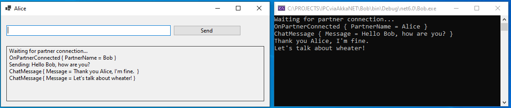

# Interprocess communication with Akka.NET

This projects demonstates interprocess communication with [`Akka.NET Remote`](https://getakka.net/).

Two apps on the same computer- Alice and Bob - communicate with each other
by sending and receiving messages. 
Each app knows the URL of the partner app.



## ADRESSING

Each app defines own address in his configuration file.
Here a snippet from Alice's `App.config`:

```
akka {
	actor {
		provider = remote
	}

	remote {
		dot-netty.tcp {
			port = 8081
			hostname = localhost
		}
	}     
}
```
Alice has the URL `localhost:8081`.

To start communication each apps needs to know the remote address of the partner app.
For sake of simplicity, partner addresses are hard-coded.

## AKKA.NET ACTOR

The project `ActorLib` defines the actor `AkkaActor` which implements core interprocess
communication logic.
The apps `Alice` (WinForms) and `Bob` (Console) are using `AkkaAktor` to exchange 
messages with each other.

## SOURCE

The Visual Studio(VS) solution consists of 3 projects:
- ActorLib (Library)
- Alice (WinForms)
- Bob (Console)

## HOW TO USE

Open VS and `Start without Debugging`. One desktop window (Alice) and one console window(Bob)
should appear. 

Type some text in one of the apps - see how your messages appears in the partner app.

Restart one of the apps - the connection should be re-established.


